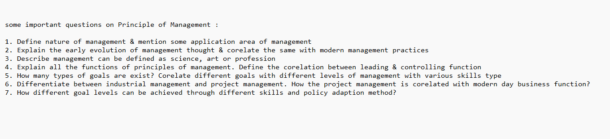

# Term 1 - Syllabus

## Database Management System :

### Module 1

1. Introduction

Concept & Overview of DBMS, Data Models, Database Languages, Database Administrator, Database Users, Three Schema architecture of DBMS.

### Module 2

1. Entity-Relationship Model

Basic concepts, Design Issues, Mapping Constraints, Keys, Entity-Relationship Diagram, Weak Entity Sets, Extended E-R features.

### Module 3

1. Relational Model

Structure of relational Databases, Relational Algebra, Relational Calculus

### Module 4

1. SQL and Integrity Constraints

Concept of DDL, DML, DCL. Basic Structure, Set operations, Aggregate Functions, Null Values, Domain Constraints, Referential Integrity Constraints, assertions, views, Nested Subqueries, Database security application development using SQL, Stored procedures and triggers.
( Short Questions only )

2. Relational Database Design

Functional Dependency, Different anomalies in designing a Database., Normalization using functional dependencies, Decomposition, Boyce-Codd Normal Form, 1NF, 2NF, 3NF

---

## Principles of Management :

Nobody knows exactly about the syllabus. Anyways, you can follow this 👇🏻

---

## Software Engineering :

### Module 1

1. Introduction

Objectives, Definitions, Software Process models – Waterfall Model, Prototype model, RAD, Evolutionary Models, Incremental, Spiral etc. new age technologies.

### Module 3

1. Structured Analysis

SA / SD, SRS, Context diagram and DFD, Physical and Logical DFDs, Data Modelling, ER diagrams, Software Requirements Specification

### Module 4

1. Design Aspects

Top-Down And Bottom-Up design; Decision tree, decision table and structured English, Structure chart, Transform analysis Functional vs. Object- Oriented approach.

### Module 5

1. Unified Modelling Language, Class diagram, interaction diagram

Collaboration diagram, sequence diagram, state chart diagram, activity diagram, implementation diagram etc.

### Module 6

1. Testing [coding & testing to be specific]

Levels of Testing, Integration Testing, System Testing.

---

## Image Processing :

### Introduction

Background, Digital Image Representation, Fundamental steps in Image Processing, Different types of imaging, Elements of Digital Image Processing - Image Acquisition, Storage, Processing, Communication, Display.

### Digital Image Formation

A Simple Image Model, types of images, Geometric ModelBasic Transformation (Translation, Scaling, Rotation), Perspective Projection, Sampling & Quantization, Neighbourhood, Connectivity, Different types of operation on image (arithmetic, logical, set). Mathematical Preliminaries: Neighbour of pixels, Connectivity, Relations, Equivalence & Transitive Closure; Distance Measures, Arithmetic/Logic Operations, Fourier Transformation, Properties of The Two Dimensional Fourier Transform, Discrete Fourier Transform, Discrete Cosine & Sine Transform. Image Enhancement: Spatial Domain Method, Frequency Domain Method, Contrast Enhancement -Linear & Nonlinear Stretching, Histogram Processing; Smoothing - Image Averaging, Mean Filter, Low-pass Filtering; Image Sharpening. High-pass Filtering, Highboost Filtering, Derivative Filtering, Homomorphic Filtering; Enhancement in the frequency domain - Low pass filtering, High pass filtering.

### Mathematical Preliminaries

Neighbour of pixels, Connectivity, Relations, Equivalence & Transitive Closure; Distance Measures, Arithmetic/Logic Operations, Fourier Transformation, Properties of The Two Dimensional Fourier Transform, Discrete Fourier Transform, Discrete Cosine & Sine Transform.

### Image Enhancement

Spatial Domain Method, Frequency Domain Method, Contrast Enhancement -Linear & Nonlinear Stretching, Histogram Processing; Smoothing - Image Averaging, Mean Filter, Low-pass Filtering; Image Sharpening. High-pass Filtering, Highboost Filtering, Derivative Filtering, Homomorphic Filtering; Enhancement in the frequency domain - Low pass filtering, High pass filtering.

---

## Formal Language & Automata Theory :

### Module 1

1. Introduction to concepts of alphabet, language, production rules, grammar and automaton, finite state model, concept of DFA and its problems, concept of NFA and its problems.

2. NFA to DFA conversion, Construction of DFA & NFA for any given string and vice versa, Minimization of FA and equivalence of two FA, Mealy & Moore machine and their problems. Limitations of FSM.

### Module 2

1. Introduction to the concept of Chomsky Classification of Grammar, language generation from production rules and vice- versa. Regular language and regular expressions, identity rules.

2. Arden’s theorem state and prove, Construction of NFA from regular expression, Conversion of NFA with null moves to without null moves, closure properties, pumping lemma and its applications.

---

## Signals & Systems :

### Module 1

1. Signals and systems as seen in everyday life, and in various branches of engineering and science.

2. Energy and power signals, continuous and discrete time signals, continuous and discrete amplitude signals.

3. System properties: linearity: additivity and homogeneity, shift-invariance, causality, stability, realizability.

### Module 2

1. Linear shift-invariant (LSI) systems, impulse response and step response, convolution, input output behavior with a periodic convergent inputs.

---

## ESP :

### Syllabus based on GATE syllabus

---

## Constitution of India :

### The syllabus is based on the notes provided in Google Classroom. You can access the notes from [here](https://github.com/therandomuser03/sem5-notes/tree/main/Notes/Constitution%20of%20India)